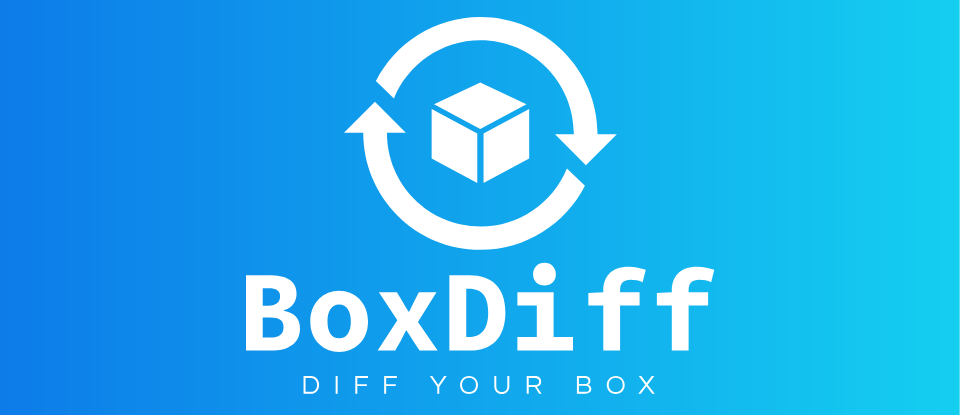

# BoxDiff
<div align="center">

A simple, dependency free, Python script that gives you a "diff" of your box by showing you what was added, removed, 
or changed
<br/>
<a href="https://discord.gg/JdrGQKqAUe">Discord</a>

</div>

## 💎 About

A simple, dependency free, Python script that gives you a "diff" of your box by showing you what was added, removed, 
or changed. 
It just executes several powershell commands and directory listings.  
Results are html files.  

Tested on Windows 11.  Other platforms not supported.  

It's designed, and meant to remain, simple and easy to maintain long term. No dependencies, no gui.  
Feel free to fork if you need major changes.

A small subset of what's collected

- Devices
- Services
- Installed Programs
- Startup Programs
- Users
- Tasks
- Certificates

If you have a suggestion for new data to be collected, create an [issue](https://github.com/boxdiff/boxdiff/issues/new)

## 📖 How to Use

```shell
# Data is written in your cwd. A container folder is helpful.
$ mkdir boxdiff
$ cd boxdiff
$ git clone git@github.com:boxdiff/boxdiff.git

# Default
$ python -m boxdiff
# Results in directory 'results_userName`. Open '0index.html'.

# With plugin
$ copy .\boxdiff\sample_plugin.py .\plugin.py
$ python -m boxdiff

# You can collect data from a different user.
# Running command prompt as Admin is required to get all data
$ python -m boxdiff
$ python -m boxdiff Administrator
$ python -m boxdiff anotherUser
```

## 🛠️ Extendable

It's easily extendable while not complicating the main script.  
`sample_plugin.py` has different examples of what's possible.  
Copy `sample_plugin.py` as `plugin.py` and rerun.

## 💻 Platform Support

Windows only (tested on Windows 11).  
Support for other platforms is not planned.

## 📜 License

MIT